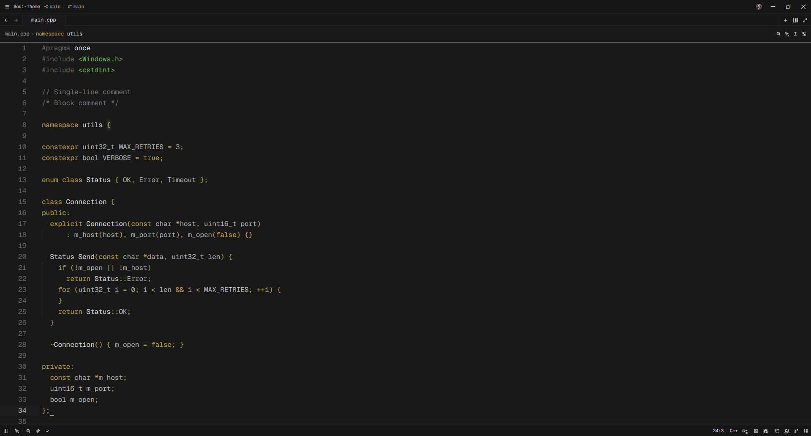

# ✨ Soul Theme

[](https://github.com/teenageswag/Soul-Theme)
[](LICENSE)
[](https://zed.dev)

A minimalistic, sophisticated dark theme for [Zed](https://zed.dev), meticulously crafted for developers who value clarity, focus, and a touch of elegance. **Soul Theme** balances deep charcoal backgrounds with warm golden accents to create an environment that feels alive yet remains gentle on the eyes.

---

## 🖼️ Preview



---

## 🌌 Philosophy

**Soul Theme** isn't just about colors; it's about the atmosphere.
- **Deep Focus**: The `#161616` background minimizes distractions.
- **Warmth**: Golden accents (`#BFAA40`) guide your eyes to what matters most.
- **Balance**: Carefully selected syntax colors ensure that code remains readable even during 12-hour sessions.

---

## 🎨 Palette

| Color | Hex | Purpose |
| :--- | :--- | :--- |
|  | `#161616` | UI Background |
|  | `#191919` | Editor Background |
|  | `#BFAA40` | Primary Accent / Keywords |
|  | `#6FB24D` | Strings / Success |
|  | `#D9D9D9` | Primary Text |
|  | `#737373` | Comments / Muted |

---

## 🚀 Installation

1. Open **Zed**.
2. Open the command palette (`Ctrl+Shift+P` or `Cmd+Shift+P`).
3. Type `extensions: install extension` and search for **Soul Theme**.
4. Alternatively, clone this repo into your extensions directory:
   ```bash
   git clone https://github.com/teenageswag/Soul-Theme.git
   ```

---

## 🛠️ Built for Zed

This theme leverages Zed's modern theming engine to provide:
- **Smooth Transitions**: Integrated UI and editor colors.
- **Crisp Typography**: Optimized contrast for modern font rendering.
- **Terminal Integration**: A cohesive terminal experience that matches your workspace.

---

## 🤝 Contributing

Found a bug or have a suggestion? Feel free to [open an issue](https://github.com/teenageswag/Soul-Theme/issues) or submit a pull request. Your feedback helps make **Soul Theme** better for everyone!

Created with ❤️ by [Artem](https://github.com/teenageswag)
